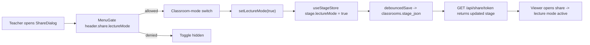

---
todos:
  - id: "registry"
    content: "Add header.share.lectureMode to lib/auth/menu-registry.ts"
    status: pending
  - id: "enforcer"
    content: "Map header.share.lectureMode under the share action in lib/auth/menu-enforcer.ts"
    status: pending
  - id: "dialog"
    content: "Add MenuGate-wrapped classroom-mode toggle in components/share/share-dialog.tsx using setLectureMode"
    status: pending
  - id: "i18n"
    content: "Add share.lectureModeLabel/Desc/On/Off and menu.header.shareLectureMode to all 6 locale JSONs"
    status: pending
isProject: false
---
## Approach

`stage.lectureMode` already exists, is persisted via `debouncedSave()` (see [lib/store/stage.ts](lib/store/stage.ts) line 583), and the share page already honors it (see [app/share/[token]/page.tsx](app/share/[token]/page.tsx) line 54). So Option C reduces to:

1. Add a **new menu_id** `header.share.lectureMode` to the RBAC registry as a child of `header.share`.
2. Map it onto the existing `share` action so deploys that already grant `share` keep working.
3. Surface a permission-gated toggle in the share dialog that reads/writes `stage.lectureMode` via the existing `setLectureMode` store action.
4. Add i18n strings for the new toggle and menu label across all 6 locales.

No schema migration, no API change, no share-route change.

## File changes

### 1. RBAC registry — [lib/auth/menu-registry.ts](lib/auth/menu-registry.ts)

Append a child menu under `header.share` (after line 66):

```ts
{
  id: 'header.share.lectureMode',
  labelKey: 'menu.header.shareLectureMode',
  parent: 'header.share',
},
```

Stable id, never to be renamed (registry contract — see file header).

### 2. Action mapping — [lib/auth/menu-enforcer.ts](lib/auth/menu-enforcer.ts)

In `ACTION_TO_MENU_OPS.share` (line 387), add the new grant so legacy env-fallback deploys with `share` action inherit the new permission:

```ts
share: [
  { menuId: 'header.share', op: 'operable' },
  { menuId: 'header.share.lectureMode', op: 'operable' },
  { menuId: 'header.sync', op: 'operable' },
],
```

Casdoor-policy deploys can still author the new menu_id explicitly to revoke it from non-teacher roles.

### 3. Share dialog — [components/share/share-dialog.tsx](components/share/share-dialog.tsx)

Below the access-mode grid (around line 258, before the `<p className="text-[11px] text-muted-foreground/60 mb-3">` description), insert a new section wrapped in `<MenuGate menu="header.share.lectureMode" op="operable">`:

- Reads `lectureMode = useStageStore((s) => !!s.stage?.lectureMode)` and `setLectureMode = useStageStore((s) => s.setLectureMode)`.
- Renders a small switch/toggle row labeled `t('share.lectureModeLabel')` with hint `t('share.lectureModeDesc')`.
- On toggle: `setLectureMode(next)` then `toast.success(next ? t('share.lectureModeOn') : t('share.lectureModeOff'))`. The store already triggers `debouncedSave()` so the change flows to the cloud and is visible to new share viewers on refresh.
- Add imports for `MenuGate` from `@/components/auth/menu-gate` and the icon (e.g. `Presentation` from `lucide-react`, matching the toolbar's choice in [components/canvas/canvas-toolbar.tsx](components/canvas/canvas-toolbar.tsx) line 417).

Visibility/operability is owned by `MenuGate`. Owner-bypass kicks in automatically because the menu does not opt out of `ownerBypass`, matching the existing toolbar behavior.

### 4. i18n strings — `lib/i18n/locales/*.json` (all 6 locales)

Under the existing `share.*` block ([zh-CN.json](lib/i18n/locales/zh-CN.json) line 330):

- `share.lectureModeLabel` — e.g. "课堂模式" / "Classroom mode"
- `share.lectureModeDesc` — e.g. "分享链接打开后进入讲解模式：教师亲自授课，自动隐藏中央播放按钮、静音 AI 朗读" / "Open the share in lecture mode: hide the central play button and mute AI narration so the teacher can present"
- `share.lectureModeOn` — e.g. "已切换为课堂模式" / "Classroom mode enabled"
- `share.lectureModeOff` — e.g. "已切换为自动模式" / "Auto mode enabled"

Under `menu.header.*` ([zh-CN.json](lib/i18n/locales/zh-CN.json) line 1298):

- `menu.header.shareLectureMode` — e.g. "分享 · 课堂模式" / "Share · Classroom mode"

Apply equivalent translations in `en-US.json`, `ja-JP.json`, `fr-FR.json`, `ru-RU.json`, `id-ID.json` (the existing locales used by the project).

## What is intentionally NOT changed

- `shares` table / `share_mode` enum — unchanged. Lecture mode stays a property of the classroom stage.
- [app/api/share/route.ts](app/api/share/route.ts), [app/api/share/[token]/route.ts](app/api/share/[token]/route.ts), [app/api/share/[token]/copy/route.ts](app/api/share/[token]/copy/route.ts) — unchanged. They already pass through `stage` to viewers.
- [app/share/[token]/page.tsx](app/share/[token]/page.tsx) — unchanged. It already reads `classroom.stage.lectureMode` and applies the viewer-side override; the new dialog toggle just changes what `stage.lectureMode` is on the persisted classroom.

## Permission flow



## Verification

- `pnpm lint` and `pnpm check` should stay clean.
- Manual: as a user without the new permission, the new toggle is hidden in the share dialog; as the classroom owner (or a granted role), the toggle appears, flipping it persists to the cloud and the next viewer hit on `/share/[token]` opens in lecture mode.
- No automated test additions required, but if there is an existing menu-registry snapshot test under `tests/`, regenerate it to include the new id.